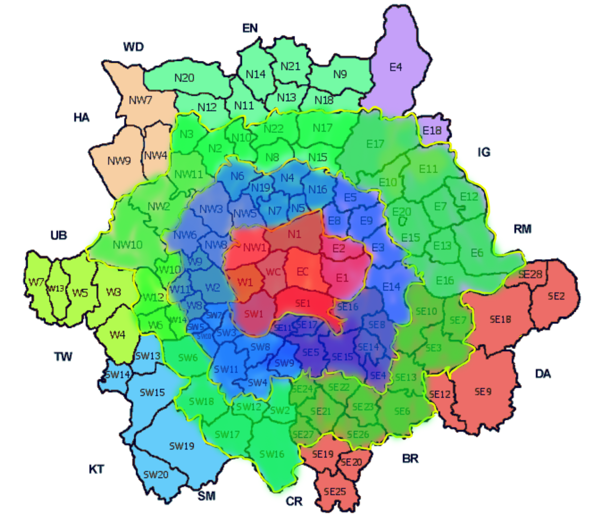

In stage 2, I am going to make the faceted plot more clear than stage 1.

I will divide the region in London into 4 big regions: from city center to further places, see the picture below.

Red represents group "Central"

Blue represents group "Middle"

Red represents group "Outer"

Unmarked region represents group "Further outer"




```{r message=FALSE}
library(tidyverse)
library(tidyr)
library(purrr)
library(scales)
library(broom)
```


```{r message = FALSE}
London <- read_csv("../data/London.csv")
```


```{r message = FALSE, warning=FALSE}
posremo <- function(postcode) {
  temp = 0
  for(index in c( 1 : (str_length(postcode)))){
    i = substr(postcode, index, index)
    if(!is.na(as.numeric(i))){
      temp = temp+1
    }
    if(is.na(as.numeric(i)) & temp > 0){
      postcode = str_remove(postcode, i)
    }
  }
  return(postcode)
}

London <- London%>%
  filter(`City/County` == "London")%>%
  separate(`Postal Code` , c("region","subregion"), " ")%>%
  mutate(
    region = map_chr(region, posremo)
  )
# Until now, this is the same code in stage 1, but now I'm doing a further step - dividing them by large groups

central <- c("WC","EC","N1","E1","E2","SE1","SW1","W1","NW1")

subcentral <- c("N6","N19","N7","N4","N5","N16","E5","E8","E9","E3","E14","SE16","SE8","SE14","SE4","SE17","SE15","SE5","SE11","SW4","SW8","SW9","SW11","SW3","SW10","SW5","SW7","W2","W8","W9","W11","NW3","NW5","NW6","NW8")

suburban <- c("N3","N2","N10","N22","N8","N17","N15","E17","E10","E11","E20","E15","E7","E12","E6","E13","E16","SE10","SE7","SE3","SE13","SE6","SE23","SE22","SE24","SE21","SE26","SE27","SW2","SW16","SW12","SW17","SW18","SW6","W6","W14","W12","W10","NW10","NW2","NW11")

London <- London%>%
  mutate(
    large_region = case_when(
      region %in% central ~ "central",
      region %in% subcentral ~ "Middle",
      region %in% suburban ~ "Outer",
      !(region %in% central | region %in% subcentral | region %in% suburban) ~ "Further Outer"
    )
  )
```

Now let's generate the plot with new groups

```{r}
# This code chunk may takes longer than others. Still finding more efficient ways to do it
pound_in_M <- label_dollar(
  prefix = "£", 
  suffix = "M",
  big.mark = ".",
  decimal.mark = ","
)
London%>%
  mutate(
    Price_in_M = Price/1000000
  )%>%
  ggplot(aes(x = `Area in sq ft`, y = Price_in_M, color = region))+
  geom_point()+
  facet_wrap(~ large_region)+
  scale_y_continuous(labels = pound_in_M)+
  geom_smooth(method = "lm", se = FALSE)
```


```{r linear regression data}
London <- London%>%
  mutate(
    price_per_sq_ft = Price/`Area in sq ft`
  )

fit_central <- lm(
  formula = price_per_sq_ft ~ large_region,
  data = London
  )
tidy(fit_central) 

fit_central_fixed <- lm(
  formula = price_per_sq_ft ~ large_region,
  data = London%>%filter(`Area in sq ft` < 14000)
  )
tidy(fit_central_fixed) 
```

```{r}
London %>%
  group_by(region) %>%
  summarise(
    price_per_sq_ft = median(price_per_sq_ft),
    large_region = large_region
  ) %>%
  ggplot(aes(x = price_per_sq_ft, fill = large_region)) +
  geom_histogram(binwidth = 40) +
  scale_color_manual(values = c("yellow","#20C5D4","#00FF67","#290916"))
  
```
```{r}
London %>%
  group_by(region) %>%
  summarise(`Area in sq ft` = mean(`Area in sq ft`),
    Price = mean(Price) , large_region = large_region) %>%
 ggplot() +
  geom_point(aes(x = `Area in sq ft`  , y = Price , color = large_region))
  
```

