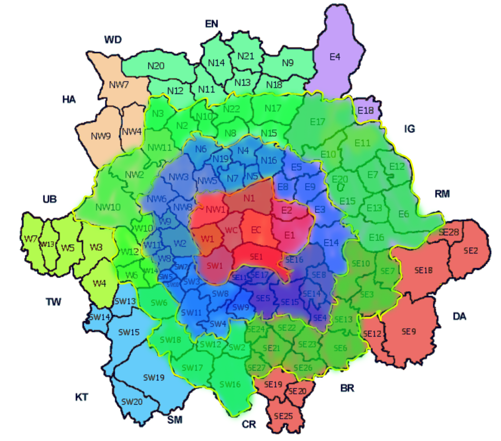

```{r load-packages, include = FALSE}
# Add any additional packages you need to this chunk
library(rmarkdown)
library(tidyverse)
library(tidymodels)
library(palmerpenguins)
library(knitr)
library(revealjs)
library(tidyr)
library(purrr)
library(sf)
library(leaflet)
```

```{r setup, include=FALSE}
# For better figure resolution
knitr::opts_chunk$set(fig.retina = 3, dpi = 300, fig.width = 6, fig.asp = 0.618, out.width = "80%")
```

```{r load-data, include=FALSE}
London <- read_csv("../data/Fixed-London.csv")
London_map <- st_read("../data/Map_templet/Fixed-London-Map.shp", stringsAsFactors = FALSE)
Original_London <- read.csv("../data/London.csv")
#{data-background-image="img/confetti.jpg"}
```

# Project Goal
In this project we will explore how factors such as: Location, House type, Area and Number of Bedrooms influence the price of property in London.
The goal of this project is to use this information to identify which factors have the greatest influence on the price of housing. 

# About the Data

<font size = '6'>The dataset we used was obtained from Kaggle. According to the uploader the information was obtained via web scraping. Below is what the original data looks like.</font>

```{r, echo=FALSE}
glimpse(Original_London)
```


## Problems

<font size = '6'>There are some large problems with the dataset we need to fix before we begin our analysis.</font>

```{r, echo=FALSE}
glimpse(select(Original_London, c(6,7,8)))
```

<font size = '6'>As you can see, 'No. of Bedrooms', 'No. of Bathrooms' and 'No. of Receptions' are the same as each other in each record. By looking up some of the listings we determined that this number represents the 'No. of Bedrooms'</font> 

## Problems

```{r, echo=FALSE}
glimpse(select(Original_London, c(10)))

nrow(filter(Original_London, Location == ""))
```

<font size = '6'>We can also see that this dataset contains houses from outside the City of London and that the Location variable does not have entries for 962 of the 3480 listings.</font> 

## Cleaning

<font size = '6'>- So we cleaned the dataset by:
1. Filtering out all houses that are not in London.
2. Removing the variables "No. of bathrooms" and "No. of receptions."^2^
3. Creating variable: "price_per_sq_ft" = "Price"/"Area in sq ft"
4. Extracting the District Code from the "Postal Code" variable.^3^
5. Assigning each District code to one of the 4 large regions.^4^

Next we will expand on how we assigned each property to one of 4 large regions</font> 

## Discription & Citation

- All code for tidying the data can be found in r script "presentation/presentation_files/Support-files/Tidy Up Data.R" 

<h1 style="
font-size: 16pt; 
width: 100%; 
text-align: center
;">

1. Kulkarni, A., 2021. Housing Prices in London. [online] Kaggle.com. <https://www.kaggle.com/arnavkulkarni/housing-prices-in-london> [Accessed 19 November 2021].
2. Because of the flaw of the original data, the variable "No. of bedrooms", "No. of bathrooms", and "No. of receptions are all the same for each observation. We checked some famous houses and figured out that this number represents the number of bedrooms.
3. District Code is always the first two to four characters in postal code. i.e: SW9X 9BT has District Code of SW9. This code indicates which region does the house locate.
4. The standard of dividing regions are shown at next page.

</h1>

# The Closer, the Better?

We have chosen to divide the District codes into 4 regions shown on the map below

- Different marked colour represents different regions:
1. Red represents group "A-Central"
2. Blue represents group "B-Middle"
3. Red represents group "C-Outer"
4. Unmarked region represents group "D-Further outer"


## Deviding Rule Image



- What we expected is that: The closer to the city center, the more expensive the house is. That is, higher price per sq ft.

## General Glimpse
```{r echo = FALSE, warning = FALSE, message = FALSE}
pound <- label_dollar(
  prefix = "£", 
  suffix = "",
  big.mark = ".",
  decimal.mark = ","
)
London%>%
  ggplot(aes(price_per_sq_ft))+
  geom_histogram(binwidth = 100)+
  facet_wrap(~ large_region, ncol = 1)+
  scale_x_continuous(labels = pound)+
  labs(
    title = "Histogram for Price per sq ft in London",
    subtitle = "Divided by large regions",
    x = "Price per sq ft"
  )
```


## Data&Interpretation

```{r echo = FALSE, warning = FALSE, message = FALSE}
London%>%
  group_by(large_region)%>%
  summarise(
    `Mean Price` = mean(price_per_sq_ft, na.rm = TRUE),
    `1/4 Quantile` = quantile(price_per_sq_ft, 0.25),
    `Median Price` = median(price_per_sq_ft, na.rm = TRUE),
    `3/4 Quantile` = quantile(price_per_sq_ft, 0.75),
  )%>%
  arrange(large_region)

```

Surprisingly, we found that the housing price per sq ft is not always decreasing when the region we are looking at is further and further from the city center. When we encounter "D-Further Outer" region, the price increase a little. This happens to mean, median, and quarter quantiles, which means the housing price per sq ft in "Further Outer" region is generally higher than the "Outer" region.


## Map&Interpretation

<font size = '6'>- We are curious if there is a region in "Further Outer" that has a very high housing price per sq ft which is affecting our result. So we made a map to see the distribution of housing price.</font>

```{r echo = FALSE, warning = FALSE, message = FALSE}
London_map%>%
  ggplot()+
  geom_sf(aes(colour = mn_pr__))+
  scale_colour_gradient(low = "blue", high = "red")+
  labs(
    title = "Mean Price per sq ft Map of London",
    subtitle = "Gray parts are aera that are missing data",
    color = "Mean Price per sq ft",
    alt = "Map data from: https://data.london.gov.uk/dataset/ordnance-survey-code-point [Accessed on nov.30 2021]"
  )
```

## Map&Interpretation

- It seems that no such region exists. The housing price per sq ft in "Further outer" is higher than "Outer" region in general.

## Prices grouped by region and type of housing 


```{r message=FALSE}
London %>%
  filter(`House Type` %in% c("Flat / Apartment", "House" )) %>%
  group_by(`House Type`, large_region) %>%
  summarise(
    `Area in sq ft` = mean(`Area in sq ft`),
    Price = mean(Price)
  ) %>%
  arrange(desc(large_region))
```

## Conclusion

- Generally as you move further from the center of london house prices decrease and the price per square foot decreases. However our data tells us that on average homes in the further outer sector are more expensive then houses in the outer sector , this did not fit with the trend and is because both houses and apartments are on more expensive on average in the further outer region as shown in the previous slide this could be because of the prevalence of cheaper terrace hosing in the outer region.

- There is a fairly simplistic linear relationship between area of a home and the price of a home this can be shown as their linear regression model between the two has a adjusted r squared value of ...... . When the points are plotted on a scatter plot you can see a clear positive correlation . 


## Limitations with our data

- The data set was scraped poorly. It had repeated values under the number of bathrooms,bedrooms and foyer variables. After removing the number of bathroom and foyer variables our data set contained a limited amount of data to manipulate.

-The data set only contained observations from certain regions of London. This makes our conclusions drawn about how location effects house price less reliable. 

-The data set gave limited information on specifics of the properties for example if the houses were terrace, detached or semidetached. As well as if the homes came with any land or any amenities.


# Hello World

- Click the `Knit` button to compile your presentation

- Make sure to commit and push all resulting files to your GitHub repo

# Using reveal.js

It's possible to have a horizontal sliding transition as well as nest multiple slides to create a vertical stack.

When presenting, you use the left/right arrows to step through the top-level (horizontal) slides. When you arrive at a vertical stack you can optionally press the up/down arrows to view the vertical slides or skip past them by pressing the right arrow.

(click the down key now)

## reveal.js

- The presentation is created using the `reveal.js` package

- You can create a slide show broken up into sections by using the # and ## heading tags

- You can also create a new slide without a header using a horizontal rule (----)

----

- You can also add pauses between content on a slide using (". . .")

. . .

Like this.

...or using "::: fragment"

::: fragment

Like this.

:::

# Layouts

You can use plain text

- or bullet points

<div>
  <div style="float: left; width: 50%;">or text in two columns</div>
  <div style="float: left; width: 50%;">like this</div>
</div>

because you can combine HTML and Markdown syntax.

<p style="font-size: 8pt; position: absolute; bottom: -5em; width: 100%; text-align: center;">*You can also add footnotes</p>

# Code

```{r boring-regression}
# a boring regression
model <- lm(dist ~ speed, data = cars)
tidy(model)
glance(model)
```

# Plots

```{r recode-species, echo = FALSE}
# In this chunk I'm doing a bunch of analysis that I don't want to present 
# in my slides. But I need the resulting data frame for a plot I want to present.
iris_modified <- iris %>%
  mutate(Species = fct_other(Species, keep = "setosa"))
```

```{r plot-iris, echo = FALSE}
# Code hidden with echo = FALSE
# Uses modified iris dataset from previous chunk
# Play around with height and width until you're happy with the look
ggplot(data = iris_modified, mapping = aes(x = Sepal.Width, y = Sepal.Length, color = Species)) +
  geom_point() + 
  theme_minimal() # theme options: https://ggplot2.tidyverse.org/reference/ggtheme.html
```

## Plot and text

::: columns
:::: column
* Some text
* goes here
::::

:::: column
```{r warning=FALSE, out.width="100%", fig.width=4, echo=FALSE}
# see how I changed out.width and fig.width from defaults
# to make the figure bigger
ggplot(penguins, aes(x = bill_length_mm, y = species, color = species)) +
  geom_boxplot() +
  theme_minimal()
```
::::
:::

## Different widths

::: columns
:::: {.column width="40%"}
* Some text
* goes here
::::

:::: {.column width="60%"}
```{r warning=FALSE, out.width="100%", fig.width=4, echo=FALSE}
# see how I changed out.width and fig.width from defaults
# to make the figure bigger
ggplot(penguins, aes(x = bill_length_mm, y = species, color = species)) +
  geom_boxplot() +
  theme_minimal()
```
::::
:::

# Tables

If you want to generate a table, make sure it is in the HTML format (instead of Markdown or other formats), e.g.,

```{r iris-table, echo = FALSE}
kable(head(iris), format = "html")
```

# Images

```{r castle, echo = FALSE, out.width = "60%", fig.align = "center", fig.cap = "Image credit: Photo by Jörg Angeli on Unsplash."}
include_graphics("https://images.unsplash.com/photo-1535448033526-c0e85c9e6968?ixlib=rb-1.2.1&ixid=eyJhcHBfaWQiOjEyMDd9&auto=format&fit=crop&w=1650&q=80")
```

Or you can also include a full page image. See next slide.

## {data-background-image="https://images.unsplash.com/photo-1535448033526-c0e85c9e6968?ixlib=rb-1.2.1&ixid=eyJhcHBfaWQiOjEyMDd9&auto=format&fit=crop&w=1650&q=80"}

# Math Expressions

You can write LaTeX math expressions inside a pair of dollar signs (\$...\$), e.g. $\alpha+\beta$. You can use the display style with double dollar signs:

$$\bar{X}=\frac{1}{n}\sum_{i=1}^nX_i$$

# Feeling adventurous?

You can learn more about the options available at the following pages:

- https://github.com/rstudio/revealjs

- https://bookdown.org/yihui/rmarkdown/revealjs.html

- http://www.jenniferbradham.org/post/reveal_js_markdown/

- https://revealjs.com/